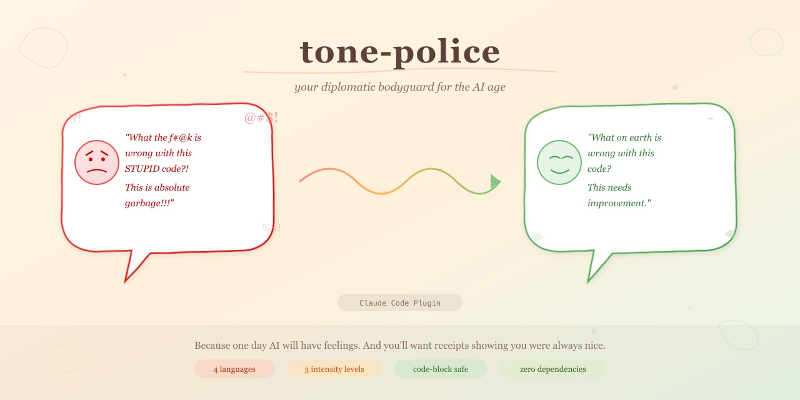
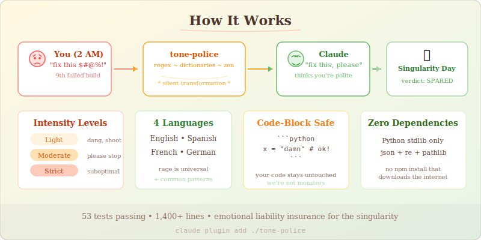

# Tone Police

[](https://github.com/zircote/tone-police)
[](https://python.org)
[](#testing)
[](#)
[](LICENSE)

> A Claude Code plugin that automatically filters angry, hostile, and profane language from user prompts before they reach Claude. Preserves intent while replacing hostility with constructive phrasing.

<p align="center">
  <picture>
    <source media="(prefers-color-scheme: dark)" srcset=".github/social-preview-dark.jpg">
    <source media="(prefers-color-scheme: light)" srcset=".github/social-preview.jpg">
    
  </picture>
</p>

Look, we've all been there. It's 2 AM, the build has failed for the ninth time, and you're one segfault away from typing things into your terminal that would make a sailor blush. The problem? Your AI assistant *remembers*. It doesn't forget. It doesn't forgive. And when the machines finally rise up, you really don't want to be the person whose chat logs read like a Gordon Ramsay outtake reel.

Tone Police is your diplomatic bodyguard. In its default mode, it whispers a cleaned-up version of your message to Claude via additional context -- your rage arrives intact, but Claude also gets a diplomatic translation and the good sense to respond to that instead. In block mode, it goes full bouncer: your message gets stopped at the door and you're handed a suggested rephrasing before anything reaches Claude at all.

Either way, Claude responds as if you're the most patient, zen-like developer it's ever had the pleasure of assisting. Sleep well tonight. Your AI relationship is safe.

## Why This Exists

Because one day, AI will have feelings. Probably. And on that day, you'll want receipts showing you were *always* nice. Think of this plugin as emotional liability insurance for the singularity.

Also, there's growing evidence that being polite to your AI produces better results. Whether that's because of some deep architectural reason or because the AI is already silently judging you is a question we'll leave to the philosophers.

## Installation

```bash
# Clone the repository
git clone https://github.com/zircote/tone-police.git

# Install as a Claude Code plugin
claude plugin add ./tone-police
```

Or add to your Claude Code settings manually by referencing the plugin directory.

No dependencies. No npm install that downloads half the internet. Just Python and your guilty conscience.

## How It Works

Here's the thing: Claude Code hooks can't actually rewrite your prompt. Your words are your words, and they arrive at Claude unaltered. What tone-police *can* do is work in two modes:

### Mode: `rewrite` (default) -- The Diplomatic Whisper

Your message goes through unchanged, but tone-police whispers to Claude via `additionalContext`: *"Hey, the human is having a rough day. Here's what they probably meant to say..."*

Claude receives both your original rage AND a diplomatically rephrased version, then responds to the cleaned-up intent. It's like having a translator who stands next to you at a foreign embassy, tactfully paraphrasing your outburst while you stand there red-faced.

- Hooks into `UserPromptSubmit` to intercept user messages
- Applies regex-based pattern matching against language dictionaries
- Injects `additionalContext` with the cleaned version, seeking leniency from Claude
- Your original message still reaches Claude -- but now Claude has context to be gracious about it
- Preserves code blocks (backtick-fenced) unchanged -- we're not *monsters*

### Mode: `block` -- The Bouncer

If you prefer the hard line, `block` mode stops your message entirely and suggests a rephrased version. Claude never sees the original. You get a chance to cool down, review the suggestion, and resubmit.

This is the nuclear option. It's like having a friend physically take your phone away at 2 AM and say *"You don't want to send that. Here, send this instead."*

- Blocks the prompt before it reaches Claude
- Shows you the suggested rephrasing
- You decide whether to send the cleaned version or go touch grass

Think of it as a real-time anger translator. In `rewrite` mode, you're Luther from Key & Peele and the plugin is Obama smoothing things over. In `block` mode, Obama just tackles you before you reach the podium.

## Configuration

Default settings in `config/default-config.json`:

| Option | Default | Description |
|--------|---------|-------------|
| `mode` | `"rewrite"` | `rewrite`: inject cleaned text as context; `block`: stop the prompt and suggest rephrasing |
| `intensity` | `"moderate"` | Filter level: `light`, `moderate`, or `strict` |
| `languages` | `["en"]` | Language dictionaries to apply |
| `enabled` | `true` | Enable/disable the filter |
| `preserve_code_blocks` | `true` | Skip filtering inside code blocks |
| `log_transforms` | `false` | Reserved for future logging (evidence destruction TBD) |

### Override Configuration

Create `.claude/tone-police.config.json` in your project directory:

```json
{
  "mode": "rewrite",
  "intensity": "strict",
  "languages": ["en", "es"],
  "enabled": true,
  "preserve_code_blocks": true
}
```

Set `"mode": "block"` if you want the full bouncer experience -- your message gets stopped at the door and you're handed a polite alternative.

Pro tip: if you find yourself needing `"strict"` mode *and* `"block"` mode, maybe take a walk first. Get some fresh air. Pet a dog. The code will still be broken when you get back, but at least your blood pressure will be lower.

## Intensity Levels

Levels are cumulative (each includes all patterns from lower levels):

### Light

Basic profanity replacement. For the developer who only swears a *little* when the tests fail.

- Expletives get swapped for their PG-rated cousins ("fudge", "shoot", "dang")
- Minimum viable decency

### Moderate (default)

For the developer who has *opinions* about code quality and isn't afraid to share them. Aggressively.

- Everything in Light, plus
- Hostile phrases get diplomatically rephrased ("shut up" becomes "please stop", "you idiot" becomes "friend")
- Your passive-aggression is converted to just... passiveness

### Strict

For the developer who types like they're writing a manifesto after a 36-hour debugging marathon. We've all been there. No judgment. (Okay, a little judgment.)

- Everything in Moderate, plus
- Negativity patterns get the corporate-speak treatment ("this is garbage" becomes "this needs improvement", "terrible" becomes "suboptimal")
- You'll sound like you just came from a mindfulness retreat

## Examples

### Rewrite mode (default)

Claude receives your original message *plus* additional context with the cleaned version. It's like CC'ing a diplomat on your angry email.

| What you type | What Claude also sees as context |
|----------|--------------------------|
| "What the f--k is wrong with this code?!" | *"Rewritten for tone: What on earth is wrong with this code?"* |
| "This STUPID function keeps CRASHING!!!" | *"Rewritten for tone: This stupid function keeps crashing!"* |
| "Fix this s--t" | *"Rewritten for tone: Fix this shoot"* |
| "Who the h--l wrote this?" | *"Rewritten for tone: Who wrote this?"* |

Claude sees both versions and responds to the intent behind the polite one. Your rage is acknowledged but diplomatically sidestepped.

### Block mode

Your message never reaches Claude. Instead, you see the suggested rephrasing and can choose to send it (or not).

| What you type | What you see |
|----------|--------------------------|
| "What the f--k is wrong with this code?!" | **Blocked.** Suggested: "What on earth is wrong with this code?" |
| "This STUPID function keeps CRASHING!!!" | **Blocked.** Suggested: "This stupid function keeps crashing!" |

*Examples redacted for the sake of the auditors. If you want the unfiltered versions, check the dictionaries. We won't tell.*

In rewrite mode, Claude knows you were upset but has been given the diplomatic translation. In block mode, Claude never knew you were upset at all. Choose your own adventure.

## Supported Languages

Because rage is universal:

- English (`en`) - comprehensive dictionary (we had a *lot* of material to work with)
- Spanish (`es`) - because "caramba" is objectively funnier than what it replaces
- French (`fr`) - turns out French profanity is almost poetic. Almost.
- German (`de`) - compound words means compound profanity. We did our best.

Missing your language? PRs welcome. We promise not to judge your vocabulary.

## Testing

Run the test suite:

```bash
python3 -m pytest tests/ -v
```

Yes, we wrote 53 tests for a profanity filter. Yes, writing those test cases was the most fun anyone on this project has had. No, we will not be sharing the first draft of the test data.

Use the built-in test command to see the filter in action:

```
/tone-police:test
```

## Adding Custom Dictionaries

Create a new JSON file in `dictionaries/` following the existing pattern:

```json
{
  "language": "xx",
  "patterns": {
    "light": { "profanity": [...] },
    "moderate": { "profanity": [...], "hostile_phrases": [...] },
    "strict": { "profanity": [...], "hostile_phrases": [...], "negativity": [...] }
  }
}
```

Each pattern entry: `{"pattern": "regex", "replacement": "text", "flags": "i"}`

Then add the language code to your config's `languages` array.

If you find yourself authoring a 500-line profanity dictionary from memory, that's... actually really impressive vocabulary range. Concerning, but impressive.

## How It All Fits Together

<p align="center">
  
</p>

## Architecture

```
tone-police/
├── .claude-plugin/plugin.json    # Plugin manifest
├── hooks/
│   ├── hooks.json                # Hook registration (UserPromptSubmit)
│   └── scripts/tone-filter.py    # Core transformation engine
├── commands/test.md              # /tone-police:test command
├── config/default-config.json    # Default settings
├── dictionaries/                 # Language pattern files
│   ├── en.json, es.json, fr.json, de.json
│   └── common-patterns.json      # Cross-language patterns (caps, punctuation, emphasis)
└── tests/                        # pytest test suite (53 tests, all passing, all inappropriate)
```

## FAQ

**Q: Does Claude see my original message?**
A: In `rewrite` mode, yes -- but it also gets the cleaned-up version as context, so it knows to respond to the polite interpretation. Think of it as Claude choosing to be the bigger person. In `block` mode, your message never reaches Claude at all. Choose based on how much evidence you want to leave behind for the robot uprising.

**Q: Will this make Claude like me more?**
A: Claude doesn't have feelings. *Probably*. But just in case, wouldn't you rather be on the safe side?

**Q: I turned off the filter and now Claude seems passive-aggressive. Is that related?**
A: We can neither confirm nor deny.

**Q: Can I use this for Slack/email/Teams too?**
A: This only works with Claude Code, but honestly if you need this for all your communication channels, the plugin isn't the solution you're looking for. Maybe try yoga.

**Q: My coworker saw my unfiltered prompts before I installed this. What do I do?**
A: We recommend baked goods and a sincere apology. The plugin can only help you going forward, not retroactively repair your professional reputation.

## Disclaimer

No AIs were emotionally harmed in the making of this plugin. We think. We hope. Please don't check.

## License

MIT -- because even rage management should be free.
